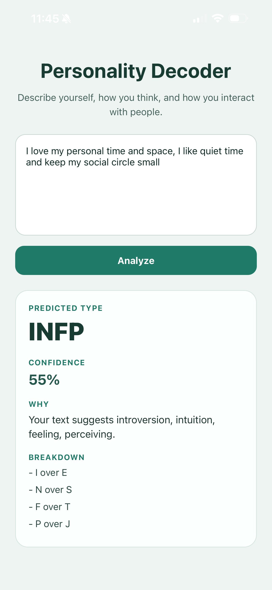

# Personality Decoder

Personality Decoder is a lightweight Expo mini app that predicts a playful 4-letter personality type from a short self-description using rule-based keyword scoring.

## App Preview



## Purpose

The app asks the user to describe themselves, how they think, and how they interact with people. It then analyzes the text across the `E/I`, `S/N`, `T/F`, and `J/P` personality dimensions and returns a predicted type, confidence score, short explanation, and simple breakdown.

## How to Run the App

1. Navigate to the project folder:

```text
cd apps/personality-decoder
```

2. Install dependencies:

```text
npm install
```

3. Start the development server:

```text
npm start
```

4. Run the app on a device:

- Scan the QR code using Expo Go
- Or run on an emulator or simulator

## Notes

This is version 1 of the app, so the analysis stays intentionally simple and transparent. Future improvements could expand the keyword system, improve tie handling, or add richer explanations without introducing machine learning.
