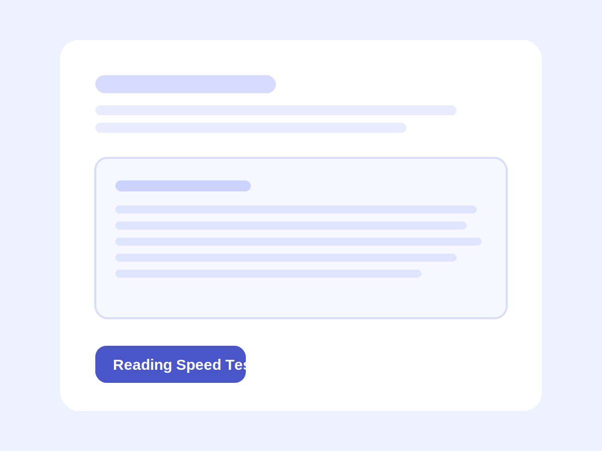

# Reading Speed Test

Reading Speed Test is a lightweight Expo mini app that measures how quickly a user reads a short passage and how well they understand it.

## App Preview



## Purpose

The app guides the user through a simple mobile reading challenge. One passage is selected from a local dataset, the reading timer starts automatically when the passage appears, and the user then completes three comprehension questions before seeing a results summary with reading speed and accuracy.

## How to Run the App

1. Navigate to the project folder:

```text
cd apps/reading-speed-test
```

2. Install dependencies:

```text
npm install
```

3. Start the development server:

```text
npm start
```

4. Run the app on a device:

- Scan the QR code using Expo Go
- Or run on an emulator or simulator

## Notes

- The reading passages and questions are stored in [src/data/passages.ts](./src/data/passages.ts)
- Version 1 uses only local state and local data with no backend or external APIs
