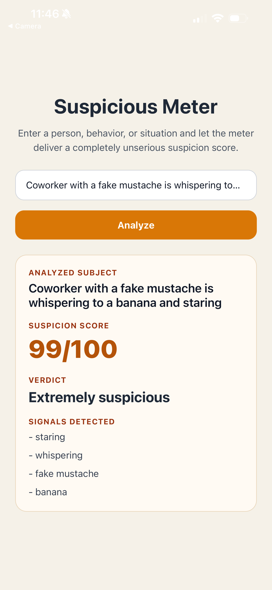

# Suspicious Meter

Suspicious Meter is a simple Expo mini app that generates a playful suspicion score and verdict from rule-based keyword analysis.

## App Preview



## Purpose

The app lets a user enter a person, behavior, or situation and then checks the text for suspicious phrases. It combines weighted keyword matches with a small random variation to produce a score, verdict, and detected-signal list on a single screen.

## How to Run the App

1. Navigate to the project folder:

```text
cd apps/suspicious-meter
```

2. Install dependencies:

```text
npm install
```

3. Start the development server:

```text
npm start
```

4. Run the app on a device:

- Scan the QR code using Expo Go
- Or run on an emulator or simulator

## Notes

The scoring system is designed to stay playful rather than serious. Future improvements could expand the keyword list, tune the weights, or add more varied verdict language while keeping the app lightweight.
